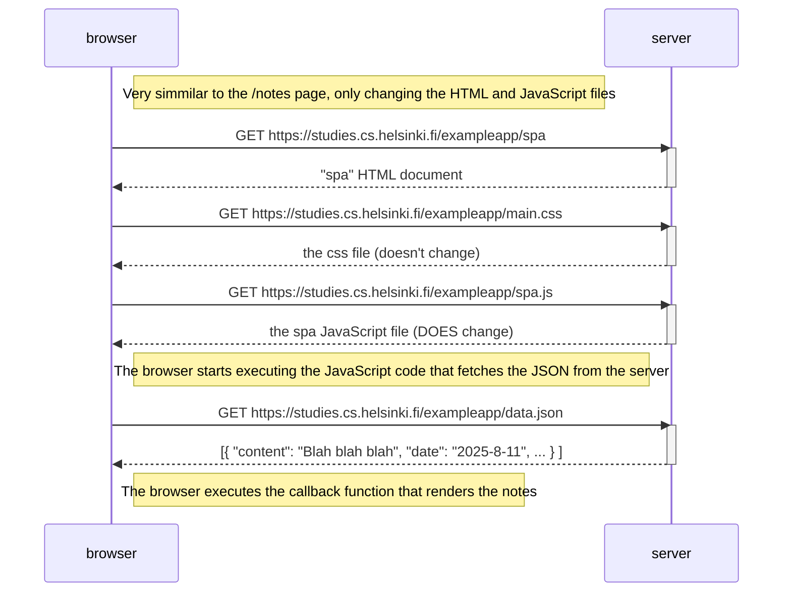

```mermaid
sequenceDiagram
    participant browser
    participant server

    Note right of browser: Very simmilar to the /notes page, only changing the HTML and JavaScript files

    browser->>server: GET https://studies.cs.helsinki.fi/exampleapp/spa
    activate server
    server-->>browser: "spa" HTML document
    deactivate server

    browser->>server: GET https://studies.cs.helsinki.fi/exampleapp/main.css
    activate server
    server-->>browser: the css file (doesn't change)
    deactivate server

    browser->>server: GET https://studies.cs.helsinki.fi/exampleapp/spa.js
    activate server
    server-->>browser: the spa JavaScript file (DOES change)
    deactivate server

    Note right of browser: The browser starts executing the JavaScript code that fetches the JSON from the server

    browser->>server: GET https://studies.cs.helsinki.fi/exampleapp/data.json
    activate server
    server-->>browser: [{ "content": "Blah blah blah", "date": "2025-8-11", ... } ]
    deactivate server

    Note right of browser: The browser executes the callback function that renders the notes
```