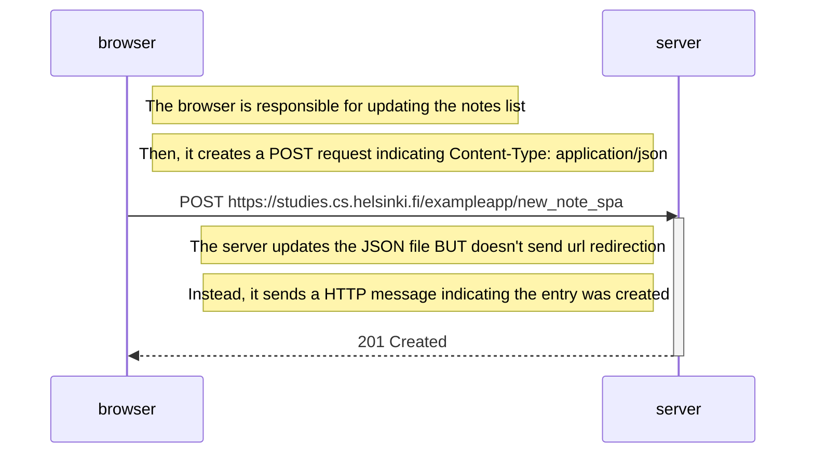

```mermaid
sequenceDiagram
    participant browser
    participant server

    Note right of browser: The browser is responsible for updating the notes list
    Note right of browser: Then, it creates a POST request indicating Content-Type: application/json

    browser->>server: POST https://studies.cs.helsinki.fi/exampleapp/new_note_spa
    activate server
    Note left of server: The server updates the JSON file BUT doesn't send url redirection
    Note left of server: Instead, it sends a HTTP message indicating the entry was created
    server-->>browser: 201 Created
    deactivate server
```